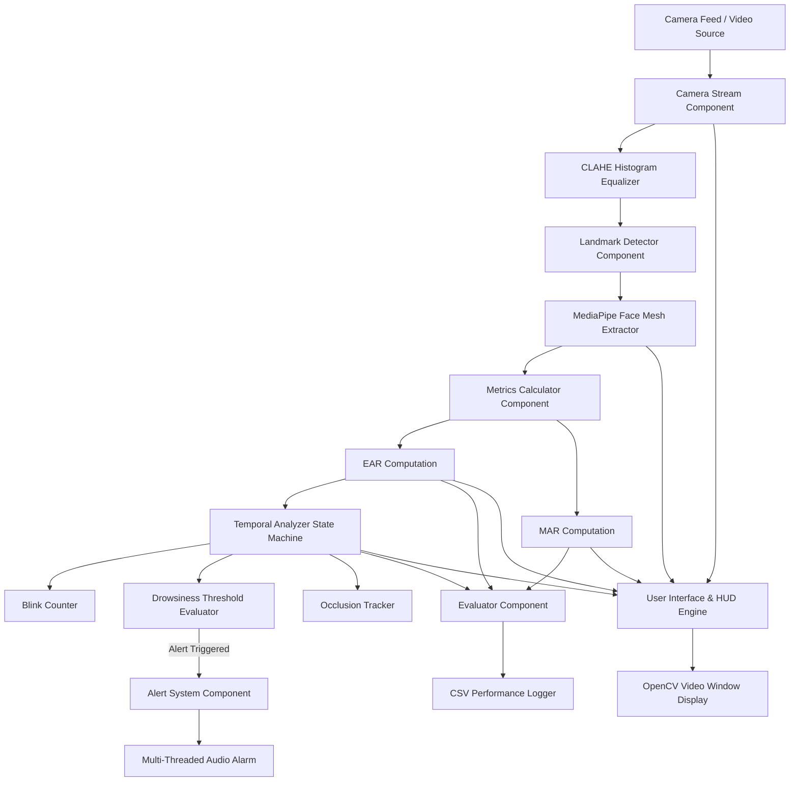
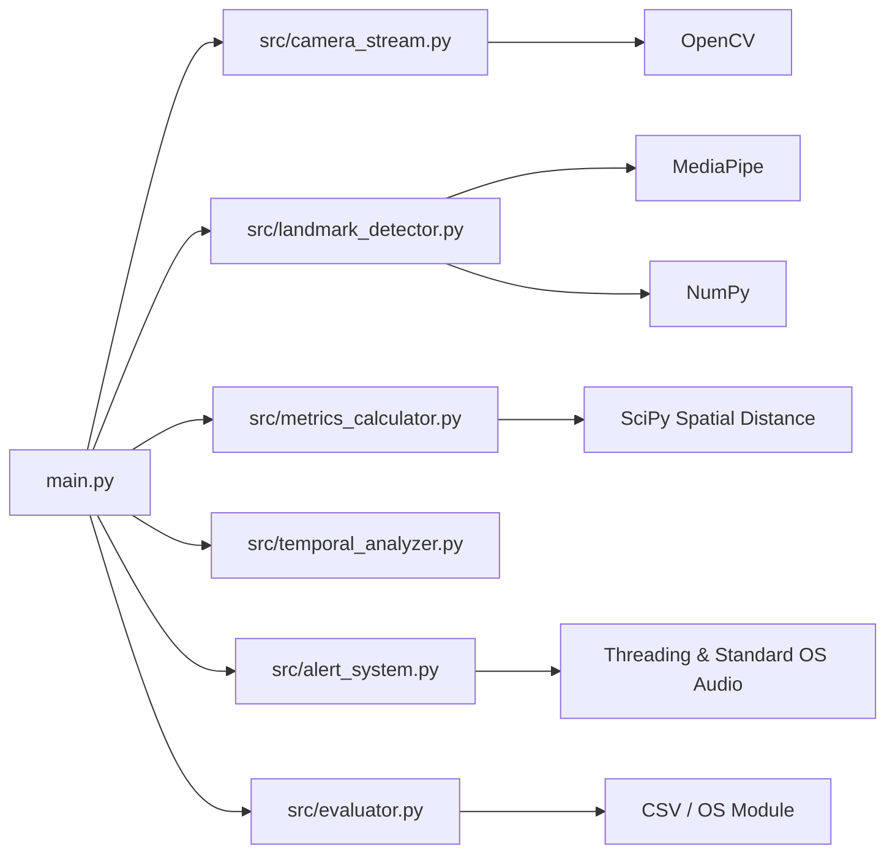
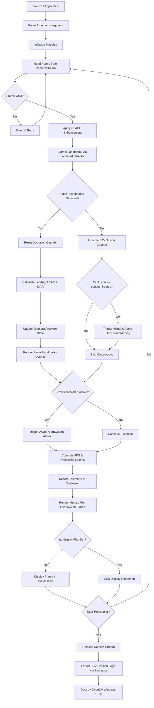
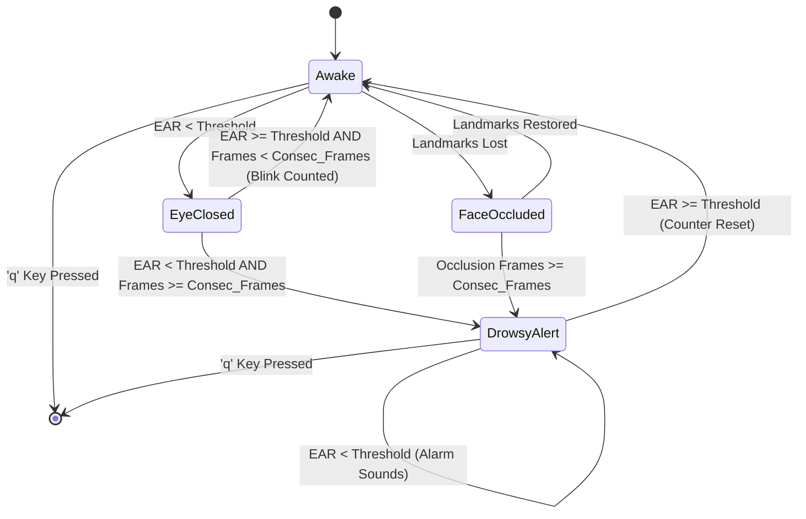
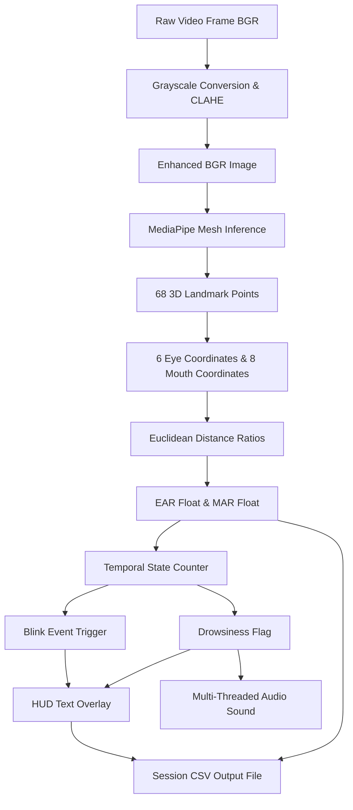
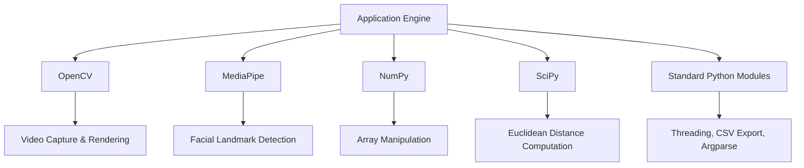

# System Architecture

## 1. Project Overview

The Real-Time Driver Drowsiness & Eye-Blink Monitor is a modular computer vision application designed to evaluate driver alertness. The system captures live video feeds, enhances low-light frame quality using CLAHE, extracts 68 facial landmarks using MediaPipe Face Mesh, computes spatial ratios (Eye Aspect Ratio and Mouth Aspect Ratio), and tracks temporal state thresholds to trigger multi-threaded alerts and log telemetry data.

---

## 2. High-Level Architecture



---

## 3. System Components

### 3.1 Camera Stream (`src/camera_stream.py`)
Responsible for frame ingestion and contrast enhancement under varying cabin lighting conditions.

* **Inputs:** Camera index (`int`) or video file path (`str`).
* **Outputs:** Original BGR video frame and CLAHE-enhanced grayscale/BGR frame.
* **Key Functions:**
  * Ingest live camera frames via `cv2.VideoCapture`.
  * Apply CLAHE (Contrast Limited Adaptive Histogram Equalization) with `clipLimit=2.0` and `tileGridSize=(8,8)`.

---

### 3.2 Landmark Detector (`src/landmark_detector.py`)
Extracts localized facial feature coordinates from incoming image frames.

* **Inputs:** Preprocessed RGB image frame.
* **Outputs:** Arrays of 2D pixel coordinates for Left Eye, Right Eye, and Mouth regions.
* **Key Functions:**
  * Initialize MediaPipe Face Mesh with refined eye/lip landmark configuration.
  * Extract 6 specific points per eye (indexes `362, 385, 387, 263, 373, 380` and `33, 160, 158, 133, 153, 144`).
  * Extract 8 inner/outer mouth boundary points (indexes `61, 81, 13, 311, 291, 402, 14, 178`).

---

### 3.3 Metrics Calculator (`src/metrics_calculator.py`)
Executes mathematical spatial geometry calculations using Euclidean distances.

* **Inputs:** Coordinate sets for eyes and mouth.
* **Outputs:** Calculated scalar floating-point values for Eye Aspect Ratio (EAR) and Mouth Aspect Ratio (MAR).
* **Key Functions:**
  * Calculate Euclidean distance between vertical and horizontal eye landmark pairs.
  * Compute average EAR across both eyes.
  * Compute MAR to evaluate yawning activities.

---

### 3.4 Temporal Analyzer (`src/temporal_analyzer.py`)
State machine evaluating frame sequence trends to distinguish normal eye blinks from sustained drowsiness closures.

* **Inputs:** Instantaneous EAR scalar value.
* **Outputs:** `blink_count` (`int`) and `drowsy_alert` (`bool`).
* **Key Functions:**
  * Increment counter when $\text{EAR} < \text{EAR Threshold}$.
  * Trigger `drowsy_alert = True` when eye closure duration exceeds consecutive frame limit (`consec_frames`).
  * Increment `blink_count` upon eye reopening if duration was less than the drowsiness threshold.

---

### 3.5 Alert System (`src/alert_system.py`)
Executes asynchronous audio feedback to notify drivers without blocking the primary vision pipeline.

* **Inputs:** Drowsiness state trigger or facial occlusion trigger.
* **Outputs:** System beep or terminal bell audio output.
* **Key Functions:**
  * Spawns daemon threads via `threading.Thread`.
  * Executes platform-specific audio output (`winsound.Beep` on Windows, `\a` terminal bell on Linux/macOS).

---

### 3.6 Evaluator (`src/evaluator.py`)
Logs telemetry metrics for academic assessment and performance profiling.

* **Inputs:** Frame timestamp, FPS, processing latency (ms), EAR, and MAR values.
* **Outputs:** Formatted CSV log file saved in `outputs/`.
* **Key Functions:**
  * Store per-frame runtime performance metrics in memory.
  * Export structured CSV session report upon application shutdown.

---

### 3.7 Entry Point & UI Engine (`main.py`)
Coordinates module execution, parses CLI arguments, and manages visual overlays.

* **Inputs:** Command line parameters (`--source`, `--ear-thresh`, `--consec-frames`, `--output-dir`, `--no-display`).
* **Outputs:** Rendered video feed with HUD metric overlays or headless terminal logs.

---

## 4. Module Dependency Diagram



---

## 5. Complete System Workflow



---

## 6. Drowsiness State Machine Architecture



---

## 7. Data Flow Diagram



---

## 8. Spatial Geometry Formulas

The mathematical calculations performed within `src/metrics_calculator.py` are governed by vector euclidean distance metrics:

### Eye Aspect Ratio (EAR)
$$\text{EAR} = \frac{\vert{}\vert{}p_2 - p_6\vert{}\vert{} + \vert{}\vert{}p_3 - p_5\vert{}\vert{}}{2 \cdot \vert{}\vert{}p_1 - p_4\vert{}\vert{}}$$

Where $p_1, \dots, p_6$ represent 2D landmark coordinates of an eye region.

### Mouth Aspect Ratio (MAR)
$$\text{MAR} = \frac{\vert{}\vert{}p_2 - p_8\vert{}\vert{} + \vert{}\vert{}p_3 - p_7\vert{}\vert{} + \vert{}\vert{}p_4 - p_6\vert{}\vert{}}{3 \cdot \vert{}\vert{}p_1 - p_5\vert{}\vert{}}$$

Where $p_1, \dots, p_8$ represent landmark coordinates outlining the inner/outer lip boundaries.

---

## 9. Project Directory Structure

```text
driver-drowsiness-monitor/
│
├── src/
│   ├── __init__.py
│   ├── alert_system.py       # Multi-threaded audio alert module
│   ├── camera_stream.py      # Video ingestion & CLAHE image processing
│   ├── evaluator.py          # Session telemetry & CSV logging
│   ├── landmark_detector.py  # MediaPipe face mesh landmark extraction
│   ├── metrics_calculator.py # EAR & MAR spatial geometry math
│   └── temporal_analyzer.py  # Drowsiness & blink state machine
│
├── docs/
│   └── architecture.md       # Complete system architecture documentation
│
├── outputs/                  # Exported session CSV logs
│   └── session_<timestamp>.csv
│
├── main.py                   # CLI entry point and execution loop
├── requirements.txt          # Explicit package dependencies
├── statement.md              # Project scope and problem definition
└── README.md                 # Project setup and user usage guide
```

---

## 10. Responsibilities of Source Files

| File | Module Name | Primary Responsibility |
| :--- | :--- | :--- |
| `main.py` | Controller | Handles CLI parsing, coordinates frame loops, manages overlays, and controls application lifecycle. |
| `src/camera_stream.py` | Ingestion | Captures video stream frames and applies CLAHE contrast enhancement for low-light conditions. |
| `src/landmark_detector.py` | Vision Pipeline | Processes RGB frames using MediaPipe Face Mesh to extract eye and mouth coordinates. |
| `src/metrics_calculator.py` | Mathematics | Computes Eye Aspect Ratio (EAR) and Mouth Aspect Ratio (MAR) using Euclidean distances. |
| `src/temporal_analyzer.py` | State Machine | Evaluates consecutive closure frames to track blink counts and trigger drowsiness alerts. |
| `src/alert_system.py` | Feedback | Asynchronously triggers audio alarms across Windows and Linux/macOS environments. |
| `src/evaluator.py` | Telemetry | Records timestamped processing metrics (FPS, latency, EAR, MAR) and exports CSV reports. |

---

## 11. External Dependencies



---

## 12. Architectural Advantages

* **Modularity:** Strict separation of frame ingestion, landmark tracking, metric computation, state analysis, and UI output into isolated Python modules.
* **Low Latency Processing:** Light spatial geometric calculations (EAR/MAR math) maintain execution speeds above 25 FPS without requiring heavy computational neural network inference per frame.
* **Low-Light Resilience:** Integrated CLAHE pre-processing mitigates illumination changes in cabin or night driving environments.
* **Headless Execution:** Suppresses GUI window rendering via `--no-display` flag for continuous integration and automated evaluation testing.
* **Asynchronous Non-Blocking Execution:** Sound generation runs on separate threads to prevent frame drops or stream freezing during active alarms.